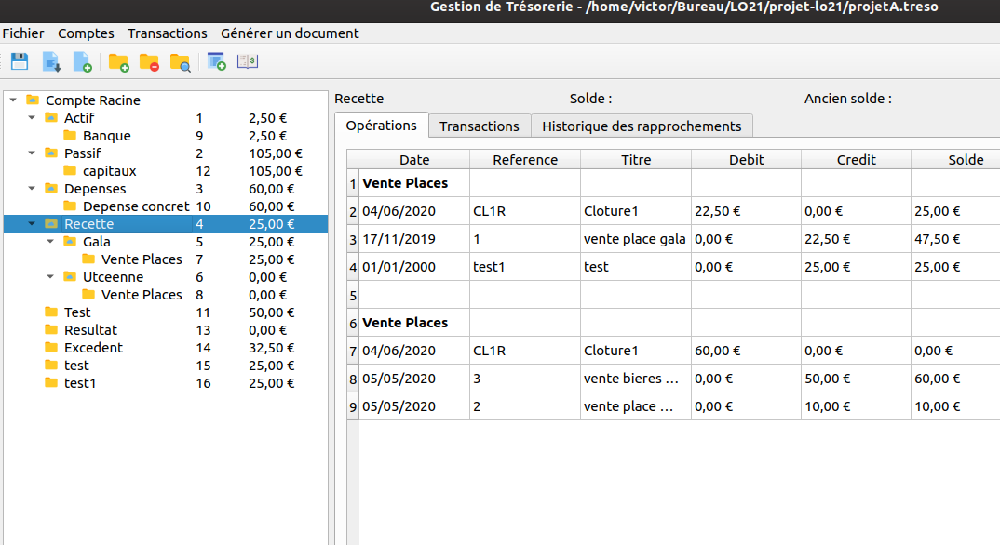
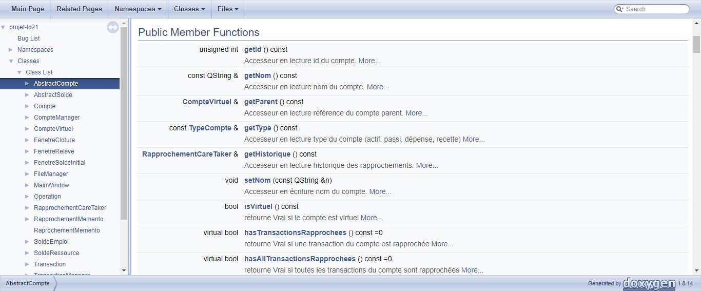
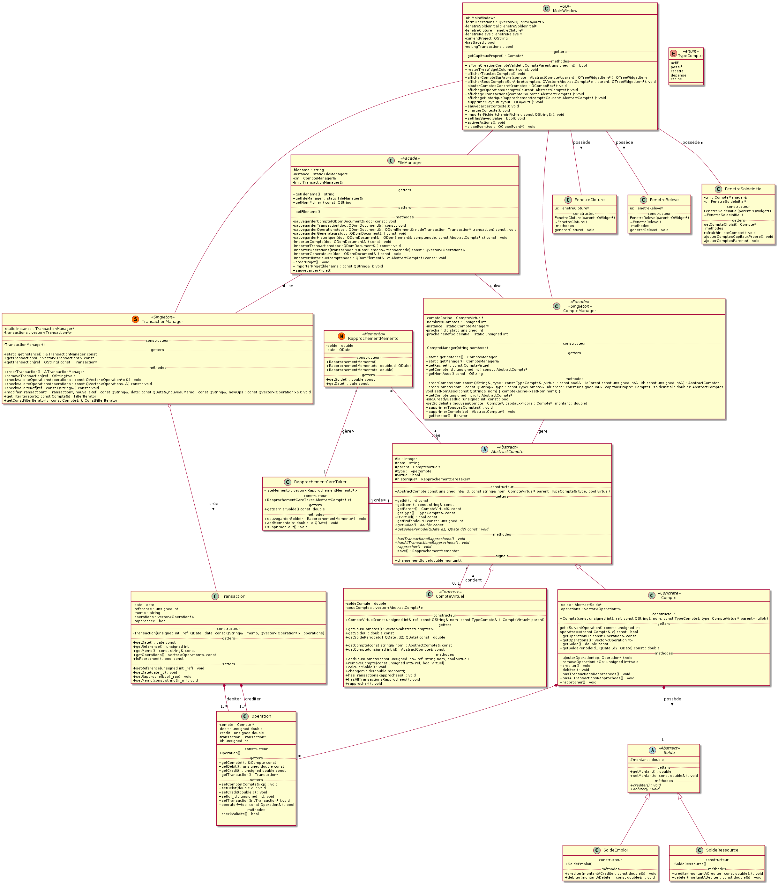

# Accounting Application

This academic project's objective is to create a financial management software for an association using C++ and Qt. 

Using the software, the user can create multiple nested accounts, enter, correct and delete transactions, and can also generate balance sheets and income statements.

## Software interface

 

## Software features

The operations implemented in the application are :

- add/remove/highlight nested accounts
- add/correct/delete simple and distributed transactions
- calculate the balance of an account
- create a closure
- reconcile an account
- edit accounting documents
- manage the persistence of information (files, database, etc.)
- save the context: when the application is started, the state of the application and the settings present at the time of the last execution are retrieved.

## Doctype

Doxygen were used to generate a complete html documentation.

 

## UML : Software architecture

