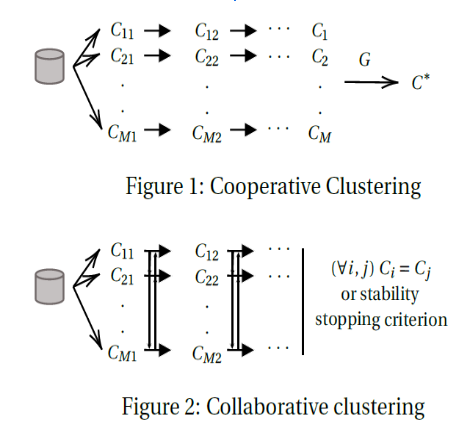

# Customer Segmentation using clustering methods

## Customer Segmentation

Customer Segmentation is the subdivision of a market into discrete customer groups that share similar characteristics. Segmentationg enables to understand different costumer profiles, see which audiences are our key target. Segmentation both supports finance purposes (amount of effort to implement) and marketing purpose (who, when and how to target).

Segmentation can be done by identifying key KPIs and creating decision trees to subdivise the population. It can also be done using unsupervised learning (PCA, clustering). While by-hand segmentation gives strict border lines between groups, clustering finds trends in datas that are smoother and which take into account all variables. 

## Ensemble clustering advantages

Each traditional clustering methods present both weaknesses and strengths. There is not one method that proved to be efficient on all kind of dataset
K-means, the most popular algorithm, is the best to find well-rounded compact clusters. It fails to recognise different shapes of clusters.

