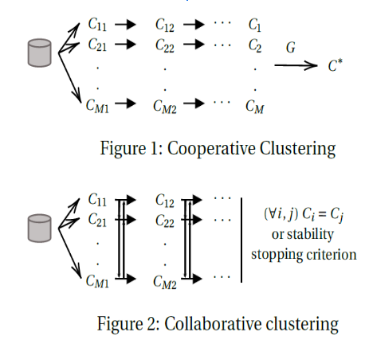
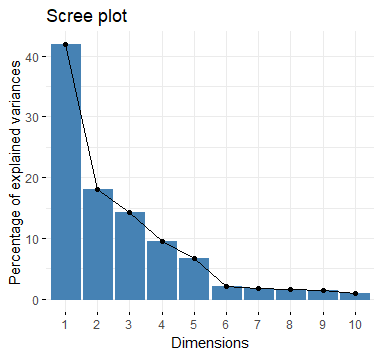
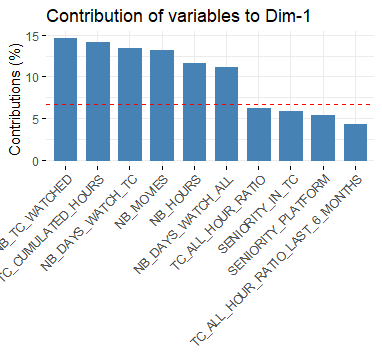
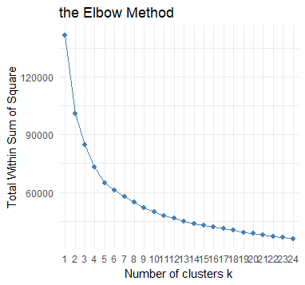
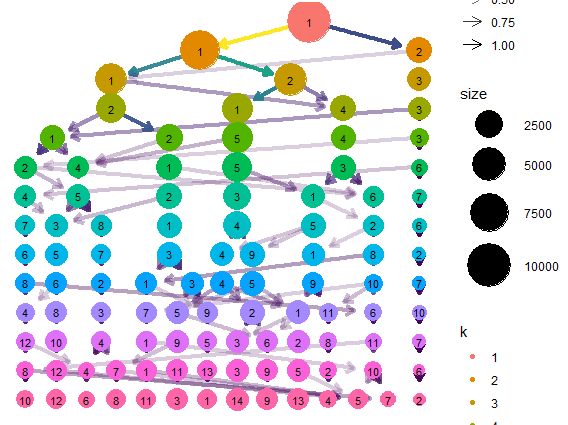
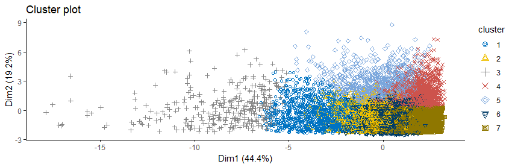

# Customer Segmentation using unsepervised learning

## Streaming platform Teen Comedy release Case Study

A streaming platform is releasing an new comedy teen movie and wants to understand the market audience for finance and marketing purposes (Media budget, CRM/marketing strategy ...).
The analysis scope concerns subscibers that watched at least 1 comedy teen movie (TC) in the last 3 years.  

I simulated viewing behaviours for 100k subscribers :

- SUBSCRIBER_ID, # User_ID
- SENIORITY_IN_TC, # Number of days since first TC watched
- SENIORITY_PLATFORM # Number of days since subscription 
- RECENCY_IN_TC, # Number of days since last TC watched
- NB_TC_WATCHED, # Number of TC watched to the end
- TC_CUMULATED_HOURS, # Number of hours spent watching TC
- NB_DAYS_WATCH_TC, # Number of days where some TC were watched 
- AVG_TC_NB_DAYS_FROM_LAUNCHED, # Avg number of days after release to watch TC
- MIN_TC_NB_DAYS_FROM_LAUNCHED, # Min number of days after release to watch TC
- MAX_TC_NB_DAYS_FROM_LAUNCHED, # Max number of days after release to watch TC
- NB_MOVIES, # Number of films watched to the end
- NB_GENRE, # Number of different genre watched 
- NB_HOURS, # Number of hours spent watching films 
- NB_DAYS_WATCH_ALL, # Number of days where some films were watched  
- TC_ALL_HOUR_RATIO, # Hour ratio of TC films watched compared to all films
- TC_ALL_HOUR_RATIO_LAST_6_MONTHS, # Hour ratio of TC films watched compared to all films in the last 6 months

## Customer Segmentation

Customer Segmentation is the subdivision of a market into discrete customer groups that share similar characteristics. Segmentationg enables to understand different costumer profiles, see which audiences are our key target. Segmentation both supports finance purposes (amount of effort to implement) and marketing purpose (who, when and how to target).

Segmentation can be done by identifying key KPIs and creating decision trees to subdivise the population. It can also be done using unsupervised learning (PCA, clustering). While by-hand segmentation gives strict border lines between groups, clustering finds trends in datas that are smoother and which take into account all variables. 

## Ensemble clustering advantages

Each traditional clustering methods present both weaknesses and strengths. There is not one method that proved to be efficient on all kind of dataset
K-means, the most popular algorithm, is the best to find well-rounded compact clusters. It fails to recognise different shapes of clusters.

Ensemble clustering combines clusters through a consensus matrix and regroups individuals that are most often clustered together. It recognises various shapes of clusters.

## Clustering results 

### PCA

  

The 7 first PCA axis explain more than 90% of the dataset variance. First axis explains 40% of data variability with nr of TC, nr of TC hours and nr of days spent to watch TC.

### Partitional clustering 

 
 

Kmeans with 7 clusters have the highest stability (over 70% for each clusters).
Kmedoids with X clusters 

### Density clustering
### Hierarchical clustering

### Collaborative clustering