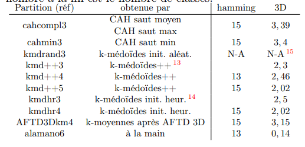
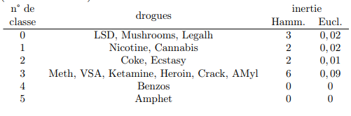
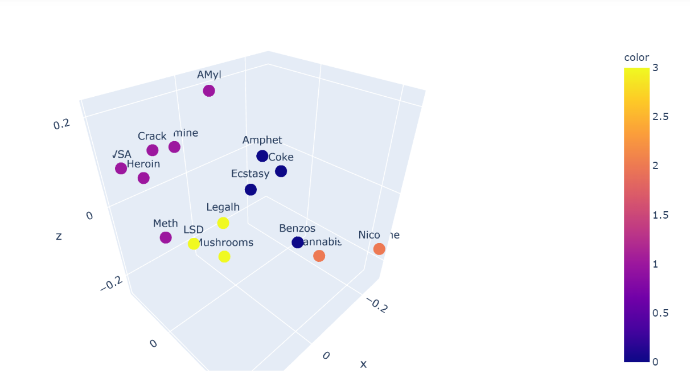
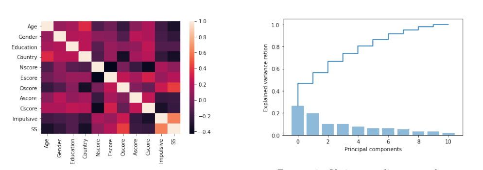
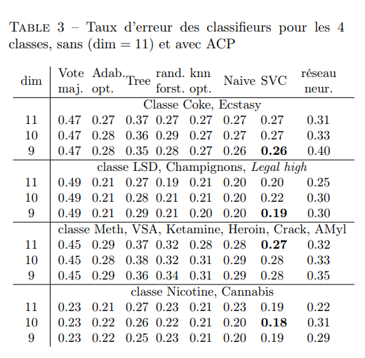

# Drug Consumption study

This machine learning academic project is a study of the consumption frequency of 18 drugs with psychological tests for two thousands medical patients. 
The goal is to detect clusters of drugs with similar consumption patterns and to predict drugs clusters most likely to be used by patients. 

For each patient, we have its frequency of consumption for 18 drugs with seven ordered modalities (never, in last 10 years, 1 year ...). We also have personal informations (sex, age, nationality ...) and results of psychological tests.

## Preprocessing 
 data cleaning, study of variable distribution and correlation. Transformation of ordered categorical variables to best fit the distributions.

## Unsupervised learning 
 Search of drugs with similar consumption patterns using clustering methods both using Hamming and Euclidean space. Selection of the best clusters using inertia and silhouette criterias.

4 macro groups of drugs were chosen :
- LSdD - Mushrooms - Legalh
- Nicotine - Cannabis
- Meth - VSA - Ketamine - Heroin - Crack - AMyl
- Coke - Ectasy

## Dimensionality reduction 
 Apply PCA to reduce the number of predictors in the dataset.

From 11 axis we can keep the first 9 that explain 94% of the dataset variability.

## Classification
Apply classification for each of those 4 groups of drugs. Each individual can be classified in 1 or more of these drugs clusters. 

    Each statistical method has first been tuned using GridSearchCV and validated using StratifiedKfold.

