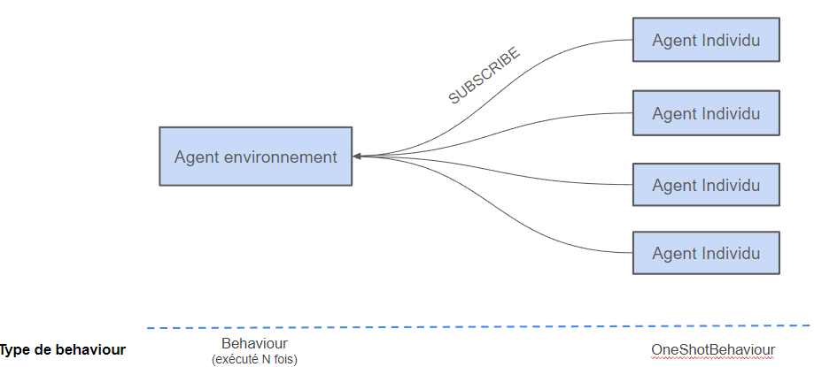
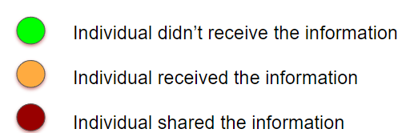

# Multi agent simulation to model fake news propagation

In this academic project, I team worked to simulate information propagation in a network environment?

We used Jade (Java Agent Development framework) to simulate agents and MASON to graphically represent network propagation.

Most of studies relating to information propagation on social network were done in the field of cognitive sciences. The project objective is to find KPIs that best simulate state of the art parameters. 

## Environment description

### Environment agent input

Individuals subscribe to the environment agent that is responsible for news creation. 

    

### Individuals agent input

  

## Graphical representation

 

 