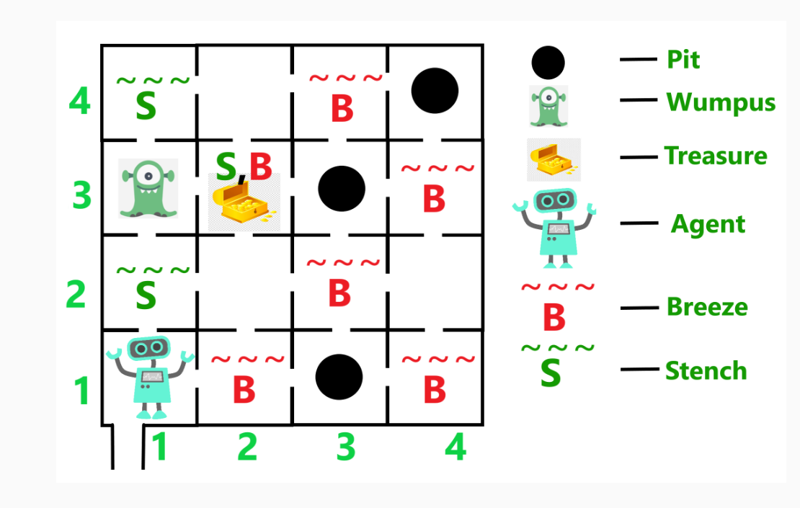

# Game Solver : Wumpus World

## World description

The Wumpus world is a maze with n*n rooms. The player is in the room [1,1]. Rooms are filled either with gold, pits or a beast (Wumpus).
The player must navigate to find the gold without falling in pits or being in the beast environment. 

We know that pits are surrounded by wind and that the wumpus is surrounded by a bad smell.

To find out what is in a room we can send two types of arrows: safe arrows and cautious arrows. A safe arrow is not expensive to send but will mark the end of the game if is faced with the wumpus or a pit. Cautious arrows can face any danger but are a expensive way to get information.

## World mapping

The first step is to feed a Gophersat, a SAT and pseudo-boolean solver written purely in Go, with the rules of the game (function definitionregles). Then I implemented a strategy to map all the wumpus world with limited money ressources (cannot use cautious arrows on every rooms). 
At each step, the function cartographier(ww,gs,size=4) tries to send safe arrows on each rooms that are considered safe by the SAT solver. When nothing is safe anymore, 1 cautious arrow is sent and the result is feeded to the SAT solver. 

## Shortest Path to gold

Once we know all the rooms we want to quickly go to the gold room(s). path_to_gold_djikstra.py uses A* algorithm in Manhattan distance, an algorithm based on Djikstra shortest path algorithm.

## Wumpus Competition 

The main execution (solver_remote_mazes.py) connects to a server that sends mazes iteratively. Through resolutions, mazes get bigger and harder (several gold rooms to find). 
During an academic competition (100 participants), I ranked in the top 5 in the maze completion accuracy (minimal spending to find the gold) and top 15 in the completion speed.